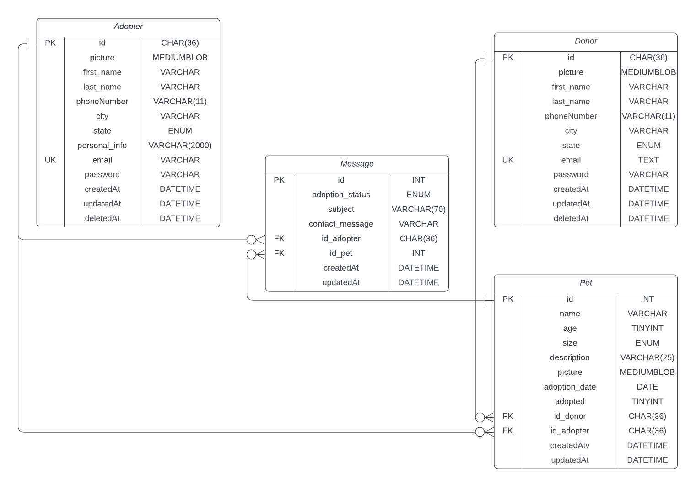

<h1 align="center">
  
Adopet -  doação e adoção de pets

 
     
 

<h2>Descrição do Projeto</h2>

Projeto Full-Stack de uma plataforma de adoção e doação de pets, seguindo os princípios do padrão MVC e implementando uma arquitetura RESTful API.

O modelo desse projeto foi baseado em um challange da Alura, porém foi adicionado mais end points, regras de negócio, sistema de autenticação, mais páginas e outras funcionalidades que serão mencionados abaixo a fim de deixar o projeto o mais próximo de um sistema real.

O usuário pode criar uma conta na intenção de doar ou de adotar um pet. O usuário que irá doar o pet pode cadastra-lo no sistema, não tendo limite para pets cadastrados.

Todos os pets disponíveis para adoção ficam visíveis para os usuários que possuem uma conta para adotar um pet, não tendo limite para pets adotados. Eles podem enviar uma mensagem para a pessoa que está doando o pet que será avaliada por ela e decidirá se aceita ou não doar para a pessoa interessada.

<h1>Diagrama de Entidade e Relacionamento (Banco de Dados)</h1>

<h1>:hammer: Funcionalidades do projeto</h1>
 <ul> 
 <li><code>CRUD pet: </code>Cadastrar, listar, editar e excluir pet.</li>
 <li><code>CRUD Usuario: </code>Cadastrar, visualizar os dados, editar os dados e exclusão da conta.</li>
 <li><code>Listagem paginada dos pets: </code>Os usuários que tem conta para adotar pet(s) podem visualizar todos os pets que ainda não foram adotados. Já os usuários que tem conta para doar pet(s), podem visualizar todos os seus pets que foram cadastrados.</li>
  <li><code>Sistema de filtragem de mensagens: </code>As mensagens enviadas pelo usuário que quer adotar e as mensagens recebidas pelo usuário que está doando são listadas e paginadas e podem ser filtradas por nome do pet, nome de usuário, ordem crescente ou decrescente e por status da adoção.</li>
 <li><code>Sistema de segurança: </code>Após se autenticar com as credenciais (email e senha), é armazenado no localstorage um token JWT que será utilizado em todas as requisições que necessitam de validação de usuário e também para fazer as validações das regras de negócio.</li>
 </ul>

<h2>:open_file_folder: Acesso ao projeto</h2>

Criar o Schema 'adopet' no MySql.

Dentro do diretório backend executar `npm run db:all` e `npm start` (porta 8000).

Dentro do diretório frontend executar `npm start` (porta 4200).

<h2>:hammer_and_wrench: Build</h2>

Dentro do diretório backend executar `npm run build:dev`.

Dentro do diretório frontend executar `npm run build:dev`.

<h2>:whale: Docker</h2>

Para inicializar o projeto em containers, executar `docker-compose up`.

<h2>Licença</h2>

- Adopet possui [MIT license](./LICENSE)
